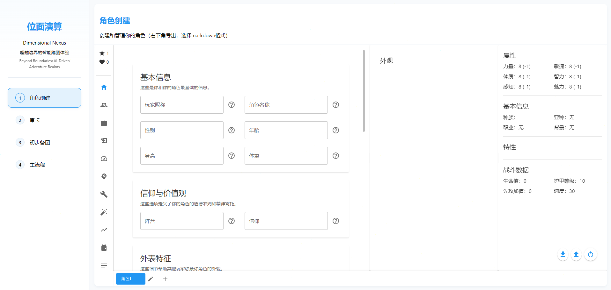
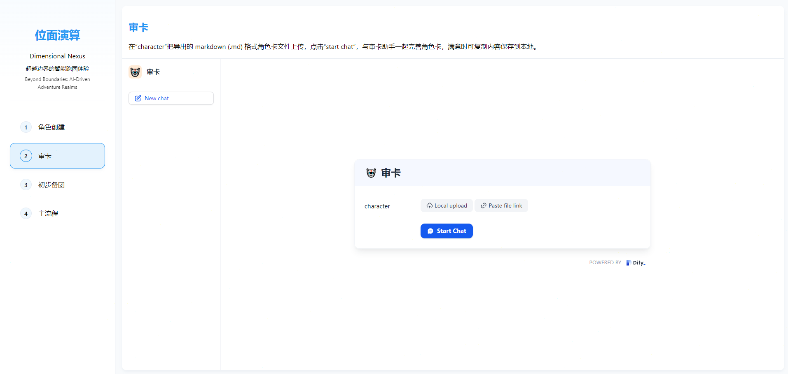
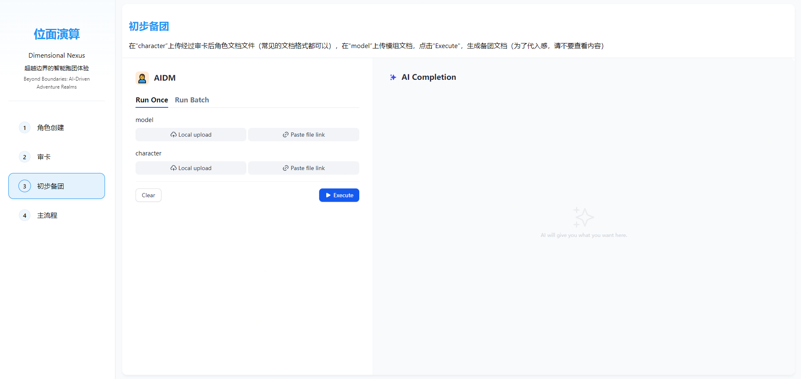
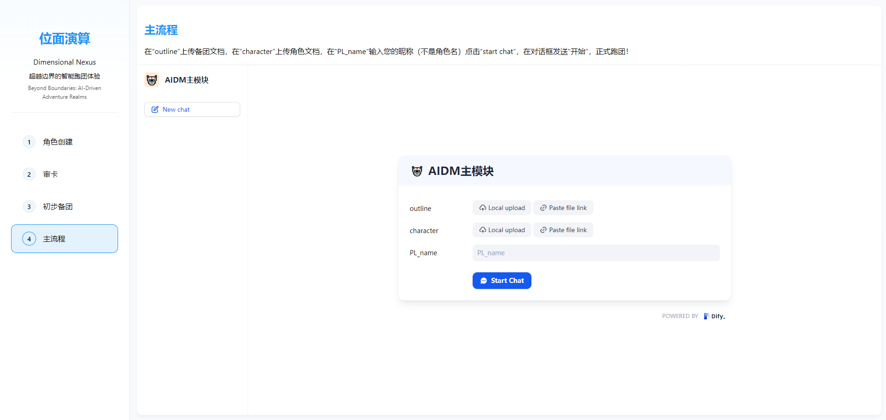

# 位面演算 (Dimensional Nexus)

超越边界的智能跑团体验
Beyond Boundaries: AI-Driven Adventure Realms

## 项目结构
```
├── index.html          # 主页面文件
├── css/               # 样式文件目录
│   ├── style.css      # 主样式文件
│   └── normalize.css   # CSS重置文件
├── js/                # JavaScript 文件目录
│   └── main.js        # 主脚本文件
└── assets/            # 资源文件目录
    └── images/        # 图片资源目录
```

## 功能模块
1. 角色创建 - Cloudflare部署的角色创建工具
2. 审卡 - Dify工作流集成
3. 初步备团 - Dify工作流集成
4. 主流程 - Dify工作流集成

## 使用方法
1. 直接在浏览器中打开 index.html
2. 选择需要使用的功能模块
3. 每个模块都可以独立使用，无需按特定顺序操作

## 技术说明
- 使用iframe方式集成Dify工作流
- 响应式设计，支持各种设备访问
- 模块化结构，便于维护和扩展

## 项目简介

Dimensional Nexus 是一个创新的智能跑团助手，它能够帮助玩家创建角色、生成剧情、管理游戏进程，让跑团体验更加丰富有趣。

## 功能展示

### 1. 角色创建

- 在角色创建页面，你可以：
  - 上传或编写角色设定
  - 使用 markdown 格式编写角色卡
  - 点击"Start Chat"开始与角色助手对话

### 2. 审核卡片

- 在这里你可以：
  - 查看生成的角色卡片
  - 确认角色设定是否符合预期
  - 根据需要修改和完善角色信息

### 3. 初步备团

- 备团功能让你能够：
  - 上传角色文档进行处理
  - 使用模型生成游戏设定
  - 通过"Execute"按钮快速生成备团文档

### 4. 主要流程

- 在主流程中你可以：
  - 与AI进行实时对话
  - 推进游戏剧情发展
  - 管理游戏进程和角色互动

## 移动端支持


虽然我们对移动端进行了适配，但为了获得最佳体验，建议：
- 优先使用PC端访问
- 移动端可用于临时查看和简单操作
- 复杂的角色创建和游戏管理建议在PC端完成

## 使用建议

1. **设备要求**
   - 推荐使用PC端访问
   - 屏幕分辨率建议 1920×1080 或更高
   - 支持主流现代浏览器（Chrome、Firefox、Edge等）

2. **最佳实践**
   - 使用markdown格式编写角色设定
   - 定期保存重要的角色信息和游戏记录
   - 在进行复杂操作时使用PC端

## 技术特点

- 响应式设计，支持多设备访问
- 实时AI对话，智能剧情生成
- 支持markdown格式的角色卡编写
- 简洁直观的用户界面

## 开发计划

- [ ] 优化移动端显示效果
- [ ] 添加更多角色模板
- [ ] 增强AI对话的上下文理解
- [ ] 支持多人协同游戏
- [ ] 添加更多游戏辅助工具

## 问题反馈

如果你在使用过程中遇到任何问题，或有任何建议，欢迎通过以下方式反馈：
1. 在项目中提交Issue
2. 通过电子邮件联系我们
3. 在社区论坛中发帖讨论

---
*注：本项目仍在持续优化中，部分功能可能会有调整和更新。*
